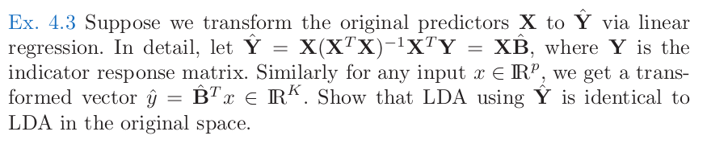

Due to COVID-19, there are a little more time that I can do something that I want but haven't got time to do in the past: reading a thick book. These days, I have been reading Hastie, Tibshirani and Friedman's _The Elements of Statistical Learning_ book. This is a great book if you are interested in knowing more of the traditional statistical learning algorithms. I hope I will get some time to write a detail book review after I finish the whole book.

Since I want to make sure I understand all the contents so I am trying to solve many exercises for each chapter. Recently I came across the Ex 4.3 about LDA. It looks like a lot of online ESL notes do not cover this question. Maybe because it is not that difficult? Anyway, I spent sometime and work out a solution and decide to post it here to contribute back to the community. Please let me know if there is anything incorrect. You can leave a comment after this post.

All right, so the question is like this:

In the LDA, the linear discriminant function is defined as:
$$
\delta_k = X^T\Sigma^{-1}\mu_k - \frac{1}{2}\mu_{k}^{T}\Sigma^{-1}\mu_{k} + \log{\pi_k}
$$

Here, the $\mu_{k}$, $\Sigma$, $\pi_{k}$ are defined as:
$$
\mu_{k} = \frac{\sum_{g_i=k}Xi}{N_{k}} \\

\Sigma = \frac{\sum_{k}\sum_{g_i=k} (X_i - \mu_{k})^{T}(X_i - \mu_{k})}{N-K} \\

\pi_{k} = \frac{N_k}{N}
$$

So what Ex 4.3 says is the LDA discriminant function will be the same if you fit it with the original raw data or linear regressed data. Let's start the proof process.

First, like what it said in the question, the fitted value is $\hat{Y}$:
$$
\hat{Y} = X(X^TX)^{-1}X^TY = XB
$$

Therefore, the $\hat{y_i}$ has the relationship to the original $x_i$ as:
$$
y_{i} = B^{T}x_{i}
$$

Next, let's figure out if we use $\hat{Y}$ to calculate LDA, what do those parameter look like. First is $\pi_k$, using $X$ or $\hat{Y}$ does not change how many number of rows you have for each class. Therefore,  $\pi'_{k} = \pi_{k}$. Next, let's move to the $\mu_k$:
$$
\mu'_{k} = \frac{\sum_{g_i=k}y_i}{N_{k}} = \frac{\sum_{g_i=k}B^{T}x_i}{N_{k}} = \frac{B^{T}\sum_{g_i=k}x_i}{N_{k}} = B^{T}\mu_{k}
$$

At last, let's look at $\Sigma$, first we need to get a theorem in statistics, if $Z=AX$，and the covariance matrix of $X$ is $\Sigma_{xx}$, then the covariance of $Z$ is $\Sigma_{zz} = A^T\Sigma_{xx}A$. Apparently $y_i$ is the linear combination of $x_i$, so we have:
$$
\Sigma' = B^{T}\Sigma B
$$
In the linear discriminant function, we actually need the inverse of this covariance matrix. Given the relationship above, what is the relationship between the inverse of them?

First, by the definition of covariance matrix, it must be a real symmetric matrix. All symmetrical matrix can be diagonalized as:
$$
\Sigma = S^T\Lambda S
$$

where $S$ is a orthonormal matrix. Take this back into the equation before we have $\Sigma' = B^TS^T\Lambda SB = (SB)^T \Lambda (SB)$. We know the inverse of $\Sigma$ is $\Sigma^{-1} = S^T\Lambda^{-1}S$. From there we can find the inverse of $\Sigma'$ is:
$$
\Sigma'^{-1}\Sigma' = [B^{-1}S^T\Lambda^{-1}S(B^T)^{-1}] * [B^TS^T\Lambda SB] = I \\

\therefore \Sigma'^{-1} = B^{-1}S^T\Lambda^{-1}S(B^T)^{-1} = B^{-1}\Sigma^{-1}(B^T)^{-1}
$$

At last, we can bring all those conclusions back to the linear discriminant function to get:
$$
\delta'_k = X^TBB^{-1}\Sigma^{-1}(B^T)^{-1}B^{T}\mu_k - \frac{1}{2}\mu_{k}^{T}BB^{-1}\Sigma^{-1}(B^T)^{-1}B^T\mu_{k} + \log{\pi_k} \\

= X^T\Sigma^{-1}\mu_k - \frac{1}{2}\mu_{k}^{T}\Sigma^{-1}\mu_{k} + \log{\pi_k} \\

= \delta_{k}
$$
QED.